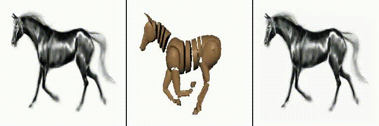

# First-order-motion-model
Implementation of First order motion model for Image Animation paper

## Installation
To run this repo, you require atleast python>=3.10,<=3.12. We made use of python==3.11.5.

Create a new virtual environment and run the following command to install the dependenices:
```
pip install -r requirements.txt
```

## Single GPU Training
Run the following command to start training:
```
python train.py --data_path /path/to/data --config_path /configs/*.yaml --log_path /path/to/logs
```

## Multi GPU Training
Move to "multi_gpu" branch of this repo and run the following:
```
python multi_gpu_train.py --data_path /path/to/data --config_path /configs/*.yaml --log_path /path/to/logs
```

## Run Inference using trained model
You can run the following command to animate any object using the trained model:
```
python run_inference.py --source_path source.gif --driving_path driving.gif --config_path /configs/*.yaml --checkpoint_path /path/to/ckp
```

## Results
I've been able to train the model on the MGIF dataset. You can download the processed version [here](https://disk.yandex.com/d/5VdqLARizmnj3Q). The following is the result that I've obtained,




## Citation

```
@InProceedings{Siarohin_2019_NeurIPS,
  author={Siarohin, Aliaksandr and Lathuilière, Stéphane and Tulyakov, Sergey and Ricci, Elisa and Sebe, Nicu},
  title={First Order Motion Model for Image Animation},
  booktitle = {Conference on Neural Information Processing Systems (NeurIPS)},
  month = {December},
  year = {2019}
}
```